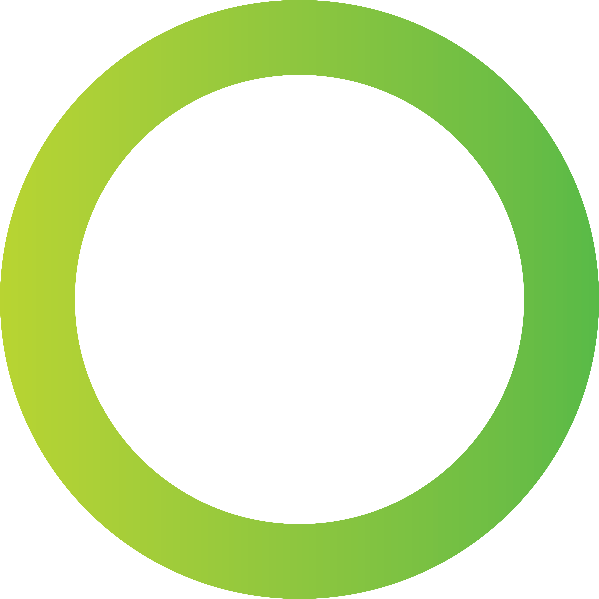

<p align="center">
  
</p>

<h1 align="center">create-nos-dapp</h1>

<p align="center">
  This is a <strong>CLI tool</strong> to generate a dApp project for the <strong>nOS</strong> platform,
  in your favorite frontend technology.
</p>

<p align="center">
  <a href='https://github.com/prettier/prettier'>
    
  </a>
</p>

## Usage

#### Important
Currently the create-nos-dapp generator tool is not yet published as a package.
Until it is published you can get started using the instructions below:

Cloning this repo
```
git clone https://github.com/nos/create-nos-dapp.git
cd create-nos-dapp
```

Installing dependencies
```
yarn install
or
npm install
```

Running the CLI tool
```
yarn build && yarn start
or
npm run build && npm start
```


## Getting started with the generated project
To get started, go to our [Getting Started](./docs/gettingStarted.md) guide. Afterwards you can check out the nOS [API documentation](https://github.com/nos/client/blob/master/docs/api.md)


## Purpose
The goal of this project is to provide a quickstart for creating nOS dApps with various frontend technologies already installed and configured to work with the nOS platform.
