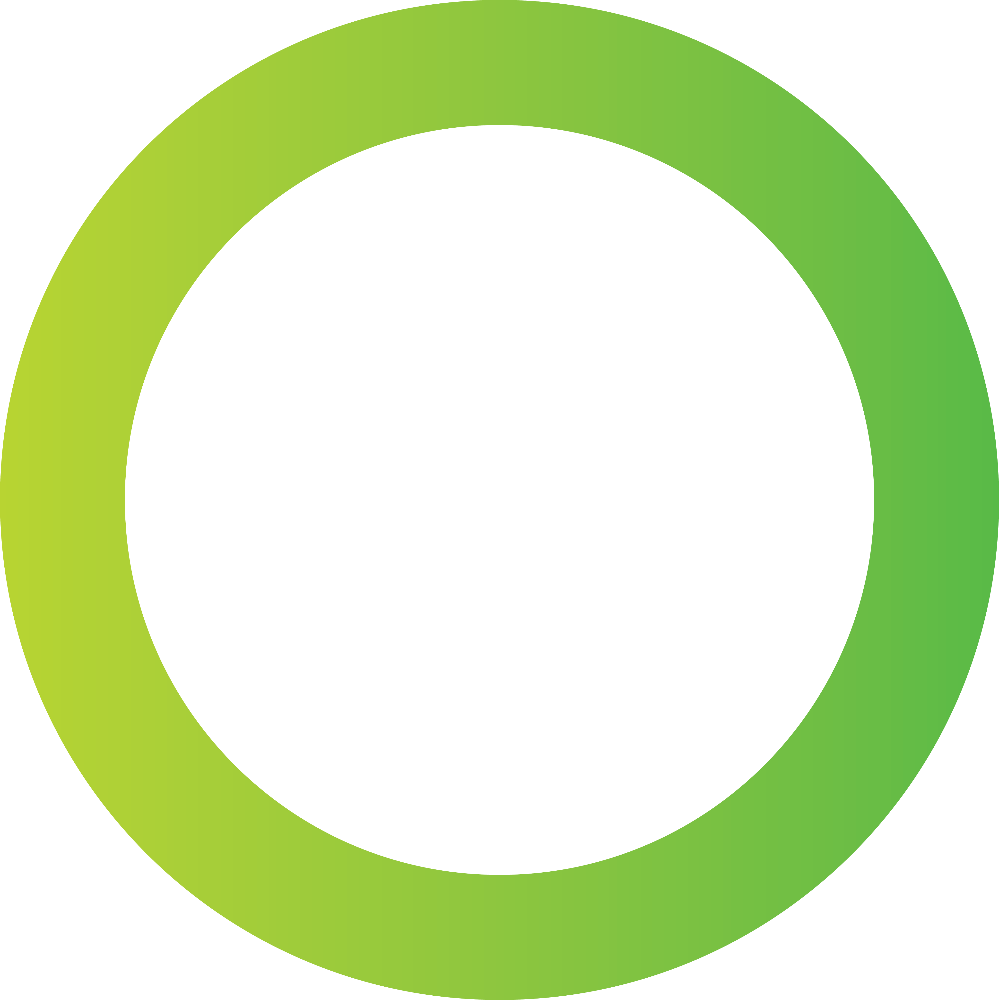

<p align="center">
   
</p>

<h1 align="center">Vuejs dApp Starter Kit</h1>

<p align="center">
  This is a starter-kit for creating a <strong>dApp</strong> on the <strong>nOS</strong> platform
</p>

<p align="center">
  <a href="https://github.com/nos/create-nos-dapp/releases">
    
  </a>
  <a href="https://standardjs.com" rel="nofollow">
    
  </a>
</p>

## Getting started
To get started, you can check out the nOS [API documentation](https://github.com/nos/client/blob/develop/docs/api.md)

## Purpose
The goal of this project is to provide a quickstart for creating nOS dApps with Vuejs and various dependencies already installed and configured.

In this repo you can find NEO specific tooling:
* nOS functions exposed in a store
* neon-js, providing extra NEO functionality

Also general frameworks and tooling:
* Vuejs, our framework of choice
* Babel and Parcel, transpiling and compiling
* ESLint linting support

## Setup
```bash
$ cd my-dapp-name
$ yarn start
```

Change `README.md` and `package.json` to fit your project needs. Delete `LICENSE` if not applicable.

## Document structure
```
react-stack-boilerplate
├── src
│   ├── main
│   ├── App
│   ├── assets
│   ├── components
│   │   ├── app-header
│   │   └── main-page
│   └── router
│       └── index
├── .babelrc
├── .eslintrc
├── .gitignore
├── LICENSE
├── package.json
├── README.md
└── yarn.lock
```

## Known issues
 * Build assets to dedicated subdirectory https://github.com/parcel-bundler/parcel/issues/233
